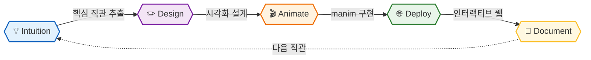

# See Why

**We make you see why.**  
**Complex concepts visualized — so the answer feels inevitable, not memorized.**

 

> *"The goal is not to explain. The goal is to make you feel it was obvious all along."*

---

## 🎯 Philosophy

수식을 외우는 것과, 왜 그 수식이 그 모양일 수밖에 없는지 아는 것은 다릅니다.

이 연구소는 **직관(Intuition)** 을 전달하는 것을 목표로 합니다.  
푸리에 변환이 왜 원운동의 합인지, Attention이 왜 QKᵀV 형태일 수밖에 없는지,  
Diffusion이 왜 노이즈를 추가했다 빼는 것으로 생성이 되는지 —  
보고 나면 **당연하게 느껴지도록.**

모든 시각화는 세 가지 기준으로 선정됩니다.

| 기준 | 설명 |
|------|------|
| **중요도** | 이걸 모르면 다른 개념이 안 열리는 것 |
| **직관 난이도** | 수식은 알아도 왜인지 모르는 것 |
| **시각화 가능성** | 움직임으로 "아하!" 순간을 만들 수 있는 것 |

---

## 📚 Visualizations

### 🧮 Mathematics — AI를 이해하는 데 직접 연결되는 수학

> 이 개념들의 직관 없이는 AI 이론의 본질에 닿을 수 없습니다

| 📌 Topic | 💡 Core Intuition | 🔗 |
|:---------|:-----------------|:---|
| **Fourier Transform** | 왜 모든 신호는 원운동의 합인가 — CNN 합성곱·Diffusion의 수학적 토대 | [📂](https://github.com/see-why-lab/fourier-transform) |
| **Eigenvectors** | 행렬 변환의 본질 — 공간이 늘어날 때 방향만 유지되는 벡터, PCA·Attention의 뿌리 | [📂](https://github.com/see-why-lab/eigenvectors) |
| **Linear Transformation** | 행렬 곱이 공간을 어떻게 뒤트는가 — 신경망 레이어가 하는 일의 본질 | [📂](https://github.com/see-why-lab/linear-transformation) |
| **Convolution** | 합성곱의 수학적 의미 — 두 함수가 겹치며 쓸려가는 것, CNN의 직관 | [📂](https://github.com/see-why-lab/convolution-math) |
| **Gradient & Topology** | 경사·등고선·방향미분의 기하학 — Loss Landscape를 걸어 내려가는 것 | [📂](https://github.com/see-why-lab/gradient-and-topology) |
| **Bayes' Theorem** | 왜 사후확률이 그렇게 바뀌는가 — 넓이로 보는 베이즈, 베이즈 추론의 직관 | [📂](https://github.com/see-why-lab/bayes-theorem) |
| **Central Limit Theorem** | 왜 어떤 분포든 더하면 정규분포가 되는가 — 정규분포가 모든 곳에 나타나는 이유 | [📂](https://github.com/see-why-lab/central-limit-theorem) |
| **Entropy Maximization** | 정보가 없을 때 왜 균등분포인가 — Cross-Entropy Loss의 수학적 근거 | [📂](https://github.com/see-why-lab/entropy-maximization) |
| **Markov Chain** | 상태 전이가 수렴하는 이유 — RL의 MDP·Diffusion 확률 과정의 직관 | [📂](https://github.com/see-why-lab/markov-chain) |
| **Brownian Motion** | 왜 무한히 작은 랜덤 보행이 연속함수인가 — Diffusion Model의 직관적 토대 | [📂](https://github.com/see-why-lab/brownian-motion) |

 

### 🤖 AI Theory — 왜 이 구조가 이러한 성능을 내는가

> 사용법이 아닌, 근본적인 이유

| 📌 Topic | 💡 Core Intuition | 🔗 |
|:---------|:-----------------|:---|
| **Attention Mechanism** | QKV가 왜 그 형태인가 — 내적이 유사도인 이유, softmax의 역할 | [📂](https://github.com/see-why-lab/attention-mechanism) |
| **Backpropagation** | 체인룰이 연산 그래프 위에서 어떻게 흐르는가 — 편미분이 역방향으로 전파 | [📂](https://github.com/see-why-lab/backpropagation) |
| **Gradient Descent** | Loss Landscape를 실제로 걸어 내려가는 시각화 — 왜 수렴하고 왜 실패하는가 | [📂](https://github.com/see-why-lab/gradient-descent) |
| **Universal Approximation** | 왜 신경망은 어떤 함수도 근사하는가 — 비선형 활성화의 역할 | [📂](https://github.com/see-why-lab/neural-network-universal) |
| **Softmax & Entropy** | softmax가 왜 확률이 되는가 — 엔트로피·Cross-Entropy Loss와의 연결 | [📂](https://github.com/see-why-lab/softmax-and-entropy) |
| **SVD & PCA** | 데이터의 본질적인 축 찾기 — 분산 최대화의 기하학, 차원 축소의 직관 | [📂](https://github.com/see-why-lab/svd-pca) |
| **Diffusion Intuition** | 왜 노이즈를 추가했다 빼는 것이 생성이 되는가 — Score Matching 직관 | [📂](https://github.com/see-why-lab/diffusion-intuition) |
| **Positional Encoding** | Transformer의 sin/cos가 왜 위치를 표현하는가 — 주파수로 순서를 인코딩 | [📂](https://github.com/see-why-lab/positional-encoding) |
| **RNN Vanishing Gradient** | 왜 시간이 길어질수록 gradient가 사라지는가 — 행렬 거듭제곱의 스펙트럴 분석 | [📂](https://github.com/see-why-lab/rnn-vanishing-gradient) |
| **Residual Connection** | skip connection이 왜 gradient 소실을 막는가 — 항등 함수 근사의 직관 | [📂](https://github.com/see-why-lab/residual-connection) |
| **Batch Normalization** | 왜 정규화가 학습을 안정시키는가 — 내부 공변량 이동의 시각화 | [📂](https://github.com/see-why-lab/batch-normalization) |
| **Dropout & Ensemble** | dropout이 왜 앙상블과 같은 효과인가 — 무작위 마스킹의 수학적 해석 | [📂](https://github.com/see-why-lab/dropout-ensemble) |
| **Kernel Trick** | 왜 고차원 내적을 저차원에서 계산할 수 있는가 — Mercer 정리의 직관 | [📂](https://github.com/see-why-lab/kernel-trick) |
| **VAE Reparameterization** | 왜 샘플링을 미분 가능하게 바꿀 수 있는가 — 확률적 노드를 통한 역전파 | [📂](https://github.com/see-why-lab/vae-reparameterization) |
| **GAN Equilibrium** | GAN이 왜 내쉬 균형을 향해 수렴하는가 — minimax 게임의 시각화 | [📂](https://github.com/see-why-lab/gans-equilibrium) |
| **Policy Gradient Theorem** | 왜 로그 미분 트릭으로 gradient를 구하는가 — 기댓값의 미분 시각화 | [📂](https://github.com/see-why-lab/policy-gradient-theorem) |
| **Bellman Optimality** | 벨만 최적 방정식이 왜 유일해를 가지는가 — 가치 함수의 수렴 시각화 | [📂](https://github.com/see-why-lab/rl-bellman-optimality) |

 

### ⚙️ Algorithms — 처음 접하면 왜 동작하는지 이해하기 어려운 것들

> 정답을 외우는 것이 아니라 왜 그것이 정답인지

| 📌 Topic | 💡 Core Intuition | 🔗 |
|:---------|:-----------------|:---|
| **Dynamic Programming** | 최적 부분구조가 왜 성립하는가 — 상태 전이와 메모이제이션의 직관 | [📂](https://github.com/see-why-lab/dynamic-programming) |
| **Dijkstra** | 왜 Greedy가 최단경로를 보장하는가 — 확정된 정점이 번지는 시각화 | [📂](https://github.com/see-why-lab/dijkstra) |
| **FFT** | DFT를 O(n²)에서 O(n log n)으로 — 분할정복과 대칭성의 마법 | [📂](https://github.com/see-why-lab/fft) |
| **Network Flow (Max-Flow Min-Cut)** | 최대 유량이 왜 최소 컷과 같은가 — 흐름과 병목의 쌍대성 | [📂](https://github.com/see-why-lab/network-flow) |
| **Union-Find** | path compression이 왜 거의 O(1)을 만드는가 — 평탄화의 누적 효과 | [📂](https://github.com/see-why-lab/union-find) |
| **Sorting Lower Bound** | 왜 비교 기반 정렬의 하한이 O(n log n)인가 — 결정 트리로 보는 정보량 | [📂](https://github.com/see-why-lab/sorting-lower-bound) |
| **Randomized Quicksort** | 왜 무작위화가 최악의 경우를 없애는가 — 기댓값으로 보는 분석 | [📂](https://github.com/see-why-lab/randomized-quicksort) |
| **Bloom Filter** | 왜 false positive는 있지만 false negative는 없는가 | [📂](https://github.com/see-why-lab/bloom-filter) |
| **NP-Completeness** | P≠NP가 왜 어려운 문제인가 — 환원(reduction)의 시각화 | [📂](https://github.com/see-why-lab/np-completeness) |

💡 각 레포는 manim 애니메이션 코드 + 인터랙티브 웹 데모를 포함합니다.

---

## 🛠️ How We Work

| Step | Description |
|------|-------------|
| 💡 **Intuition** | "왜?"라는 질문에서 시작 — 핵심 직관 한 문장으로 정의 |
| ✏️ **Design** | 어떤 움직임이 그 직관을 전달하는가 설계 |
| 🎬 **Animate** | manim으로 수학적으로 정확한 애니메이션 구현 |
| 🌐 **Deploy** | 같은 개념을 인터랙티브 웹 데모로 구현 |
| 📝 **Document** | 수식·코드·직관을 함께 정리 |

---

## 🔧 Tech Stack

| 도구 | 용도 |
|------|------|
| **manim** | 수학 애니메이션 영상 제작 (3Blue1Brown 사용 라이브러리) |
| **p5.js** | 인터랙티브 웹 시각화 |
| **three.js** | 3D 개념 시각화 |
| **d3.js** | 데이터 기반 시각화 |

---

## 💡 Philosophy

> **"The best teachers don't simplify.**  
> **They find the perspective from which complexity becomes obvious."**

---

## 🔗 Related

*개발 기술의 구현 원리는 IQ Dev Lab에서,  
AI의 수학적 증명은 IQ AI Lab에서 탐구합니다.*

 

**⭐️ 도움이 되셨다면 Star를눌러주세요!**

